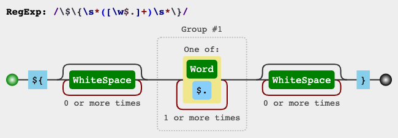

# node-expression

```
npm install @orioro/expression
```

Framework of expression interpreters.

# Use cases

## Data querying

Main modules: `comparison` and `object`

```js
const person = {
  givenName: 'João',
  middleName: 'Cruz',
  familyName: 'Silva',
  age: 32,
  interests: ['sport', 'music', 'books'],
  mother: {
    givenName: 'Maria',
    familyName: 'Cruz',
    age: 57
  },
  father: {
    givenName: 'Pedro',
    familyName: 'Silva',
    age: 56
  }
}

const context = {
  interpreters,
  scope: { $$VALUE: person }
}

// Simple equality comparison
evaluate(context, ['$objectMatches', { givenName: 'João' }]) // true
evaluate(context, ['$objectMatches', { givenName: 'Maria' }]) // false

// Use dot (.) path notation to access nested properties
evaluate(context, ['$objectMatches', {
  'mother.age': { $gte: 20, $lte: 50 },
  'father.age': { $gte: 20, $lte: 50 }
}]) // false
```

## Tree structure formatting

```js
TODO
```

## Conditional evaluation
```js
TODO
// const context = {
//   interpreters,
//   scope: {
//     $$VALUE: {
//       name: 'João',
//       interests: ['music', 'sports']
//       age: 30
//     }
//   }
// }

// const cases = [
//   [['$objectMatches', {
//     interests: {
//       $arrayIncludes: 'music'
//     }
//   }]]
// ]
```

# API

**Built-in expressions:**

- [Array](#Array)
- [Boolean](#Boolean)
- [Comparison](#Comparison)
- [Date](#Date)
- [Functional](#Functional)
- [Logical](#Logical)
- [Math](#Math)
- [Number](#Number)
- [Object](#Object)
- [String](#String)
- [Type](#Type)
- [Value](#Value)

**External expression modules:**

- [Date `@orioro/expression-date`](https://www.npmjs.com/package/@orioro/expression-date)
- [RegExp `@orioro/expression-regexp`](https://www.npmjs.com/package/@orioro/expression-regexp)

## Array

- [`$arrayIncludes(searchValue, array)`](#arrayincludessearchvalue-array)
- [`$arrayIncludesAll(searchValues, array)`](#arrayincludesallsearchvalues-array)
- [`$arrayIncludesAny(searchValue, array)`](#arrayincludesanysearchvalue-array)
- [`$arrayLength(array)`](#arraylengtharray)
- [`$arrayReduce(reduceExp, start, array)`](#arrayreducereduceexp-start-array)
- [`$arrayMap(mapExp, array)`](#arraymapmapexp-array)
- [`$arrayEvery(testExp, array)`](#arrayeverytestexp-array)
- [`$arraySome(someExp, array)`](#arraysomesomeexp-array)
- [`$arrayFilter(queryExp, array)`](#arrayfilterqueryexp-array)
- [`$arrayFindIndex(queryExp, array)`](#arrayfindindexqueryexp-array)
- [`$arrayIndexOf(value, array)`](#arrayindexofvalue-array)
- [`$arrayFind(queryExp, array)`](#arrayfindqueryexp-array)
- [`$arrayReverse(array)`](#arrayreversearray)
- [`$arraySort(sort, array)`](#arraysortsort-array)
- [`$arrayPush(valueExp, array)`](#arraypushvalueexp-array)
- [`$arrayPop(array)`](#arraypoparray)
- [`$arrayUnshift(valueExp, array)`](#arrayunshiftvalueexp-array)
- [`$arrayShift(array)`](#arrayshiftarray)
- [`$arraySlice(start, end, array)`](#arrayslicestart-end-array)
- [`$arrayReplace(indexOrRange, values, array)`](#arrayreplaceindexorrange-values-array)
- [`$arrayAddAt(index, values, array)`](#arrayaddatindex-values-array)
- [`$arrayRemoveAt(index, countExp, array)`](#arrayremoveatindex-countexp-array)
- [`$arrayJoin(separator, array)`](#arrayjoinseparator-array)
- [`$arrayAt(index, array)`](#arrayatindex-array)


##### `$arrayIncludes(searchValue, array)`

Equivalent of `Array.prototype.includes`.

- `searchValue` {*}
- `array` {Array}
- Returns: `includes` {Boolean} 

##### `$arrayIncludesAll(searchValues, array)`

Similar to `$arrayIncludes`, but receives an array
of values to be searched for and returns whether the
context array contains all of the searched values.

- `searchValues` {Array}
- `array` {Array}
- Returns: `includesAll` {Boolean} 

##### `$arrayIncludesAny(searchValue, array)`

Similar to `$arrayIncludes`, but returns true if
any of the searched values is in the array.

- `searchValue` {Array}
- `array` {Array}
- Returns: `includesAny` {Boolean} 

##### `$arrayLength(array)`

- `array` {Array}
- Returns: `length` {Number} 

##### `$arrayReduce(reduceExp, start, array)`

- `reduceExp` {[Expression](#expression)}
- `start` {*}
- `array` {Array}

##### `$arrayMap(mapExp, array)`

- `mapExp` {[Expression](#expression)}
- `array` {Array}

##### `$arrayEvery(testExp, array)`

`Array.prototype.every`

Result is similar to logical operator `$and`. Main difference
(and reason for existence as isolate expression) is that
$arrayEvery exposes array iteration variables:
`$$PARENT_SCOPE`, `$$VALUE`, `$$INDEX`, `$$ARRAY`

- `testExp` {[Expression](#expression)}
- `array` {Array}

##### `$arraySome(someExp, array)`

`Array.prototype.some`

- `someExp` {[Expression](#expression)}
- `array` {Array}

##### `$arrayFilter(queryExp, array)`

- `queryExp` {Boolean}
- `array` {Array}

##### `$arrayFindIndex(queryExp, array)`

- `queryExp` {Boolean}
- `array` {Array}

##### `$arrayIndexOf(value, array)`

- `value` {*}
- `array` {Array}

##### `$arrayFind(queryExp, array)`

- `queryExp` {Boolean}
- `array` {Array}

##### `$arrayReverse(array)`

- `array` {Array}

##### `$arraySort(sort, array)`

- `sort` {String | [Expression](#expression) | [Expression, string]}
- `array` {Array}

##### `$arrayPush(valueExp, array)`

- `valueExp` {*}
- `array` {Array}

##### `$arrayPop(array)`

- `array` {Array}

##### `$arrayUnshift(valueExp, array)`

- `valueExp` {*}
- `array` {Array}

##### `$arrayShift(array)`

- `array` {Array}

##### `$arraySlice(start, end, array)`

- `start` {Number}
- `end` {Number}
- `array` {Array}
- Returns: {Array} 

##### `$arrayReplace(indexOrRange, values, array)`

- `indexOrRange` {Number | [Number, Number]}
- `values` {Array}
- `array` {Array}
- Returns: {Array} 

##### `$arrayAddAt(index, values, array)`

Adds items at the given position.

- `index` {Number}
- `values` {* | Array}
- `array` {Array}
- Returns: `resultingArray` {Array} The array with items added at position

##### `$arrayRemoveAt(index, countExp, array)`

- `index` {Number}
- `countExp` {Number}
- `array` {Array}
- Returns: `resultingArray` {Array} The array without the removed item

##### `$arrayJoin(separator, array)`

- `separator` {String}
- `array` {Array}
- Returns: {String} 

##### `$arrayAt(index, array)`

- `index` {Number}
- `array` {Array}
- Returns: `value` {*} 


## Boolean

- [`$boolean(value)`](#booleanvalue)


##### `$boolean(value)`

- `value` {*}
- Returns: {Boolean} 


## Comparison

- [`$eq(referenceExp, valueExp)`](#eqreferenceexp-valueexp)
- [`$notEq(referenceExp, valueExp)`](#noteqreferenceexp-valueexp)
- [`$in(arrayExp, valueExp)`](#inarrayexp-valueexp)
- [`$notIn(arrayExp, valueExp)`](#notinarrayexp-valueexp)
- [`$gt(referenceExp, valueExp)`](#gtreferenceexp-valueexp)
- [`$gte(referenceExp, valueExp)`](#gtereferenceexp-valueexp)
- [`$lt(referenceExp, valueExp)`](#ltreferenceexp-valueexp)
- [`$lte(referenceExp, valueExp)`](#ltereferenceexp-valueexp)
- [`$matches(criteriaExp, valueExp)`](#matchescriteriaexp-valueexp)


##### `$eq(referenceExp, valueExp)`

Checks if the two values

- `referenceExp` {*}
- `valueExp` {*}
- Returns: {Boolean} 

##### `$notEq(referenceExp, valueExp)`

- `referenceExp` {*}
- `valueExp` {*}
- Returns: {Boolean} 

##### `$in(arrayExp, valueExp)`

Checks whether the value is in the given array.

- `arrayExp` {Array}
- `valueExp` {*}
- Returns: {Boolean} 

##### `$notIn(arrayExp, valueExp)`

Checks whether the value is **not** in the given array.

- `arrayExp` {Array}
- `valueExp` {*}
- Returns: {Boolean} 

##### `$gt(referenceExp, valueExp)`

Greater than `value > threshold`

- `referenceExp` {Number}
- `valueExp` {Number}
- Returns: {Boolean} 

##### `$gte(referenceExp, valueExp)`

Greater than or equal `value >= threshold`

- `referenceExp` {Number}
- `valueExp` {Number}
- Returns: {Boolean} 

##### `$lt(referenceExp, valueExp)`

Lesser than `value < threshold`

- `referenceExp` {Number}
- `valueExp` {Number}
- Returns: {Boolean} 

##### `$lte(referenceExp, valueExp)`

Lesser than or equal `value <= threshold`

- `referenceExp` {Number}
- `valueExp` {Number}
- Returns: {Boolean} 

##### `$matches(criteriaExp, valueExp)`

Checks if the value matches the set of criteria.

- `criteriaExp` {Object}
- `valueExp` {Number}
- Returns: {Boolean} 


## Functional

- [`$pipe(expressions)`](#pipeexpressions)
- [`$try(expressionOrValue, catchExpressionOrValue)`](#tryexpressionorvalue-catchexpressionorvalue)


##### `$pipe(expressions)`

- `expressions` {[Expression](#expression)[]}
- Returns: `pipeResult` {*} 

##### `$try(expressionOrValue, catchExpressionOrValue)`

- `expressionOrValue` {[Expression](#expression) | *}
- `catchExpressionOrValue` {[Expression](#expression) | *}


## Logical

- [`$and(expressionsExp)`](#andexpressionsexp)
- [`$or(expressionsExp)`](#orexpressionsexp)
- [`$not(expressionsExp)`](#notexpressionsexp)
- [`$nor(expressionsExp)`](#norexpressionsexp)
- [`$xor(expressionA, expressionB)`](#xorexpressiona-expressionb)
- [`$if(conditionExp, thenExp, elseExp)`](#ifconditionexp-thenexp-elseexp)
- [`$switch(cases, defaultExp)`](#switchcases-defaultexp)
- [`$switchKey(cases, defaultExp, ValueExp)`](#switchkeycases-defaultexp-valueexp)


##### `$and(expressionsExp)`

- `expressionsExp` {Array}
- Returns: {Boolean} 

##### `$or(expressionsExp)`

- `expressionsExp` {Array}
- Returns: {Boolean} 

##### `$not(expressionsExp)`

- `expressionsExp` {Array}
- Returns: {Boolean} 

##### `$nor(expressionsExp)`

- `expressionsExp` {Array}
- Returns: {Boolean} 

##### `$xor(expressionA, expressionB)`

- `expressionA` {Boolean}
- `expressionB` {Boolean}
- Returns: {Boolean} 

##### `$if(conditionExp, thenExp, elseExp)`

- `conditionExp` {Boolean}
- `thenExp` {[Expression](#expression)}
- `elseExp` {[Expression](#expression)}
- Returns: `result` {*} 

##### `$switch(cases, defaultExp)`

- `cases` {Array}
- `defaultExp` {[Expression](#expression)}
- Returns: `result` {*} 

##### `$switchKey(cases, defaultExp, ValueExp)`

- `cases` {Cases[]}
  - `0` {String}
  - `1` {*}
- `defaultExp` {*}
- `ValueExp` {String}
- Returns: {*} 


## Math

- [`$mathSum(sum, base)`](#mathsumsum-base)
- [`$mathSub(subtract, base)`](#mathsubsubtract-base)
- [`$mathMult(multiplier, base)`](#mathmultmultiplier-base)
- [`$mathDiv(divisor, dividend)`](#mathdivdivisor-dividend)
- [`$mathMod(divisor, dividend)`](#mathmoddivisor-dividend)
- [`$mathPow(exponent, base)`](#mathpowexponent-base)
- [`$mathAbs(value)`](#mathabsvalue)
- [`$mathMax(otherValue, value)`](#mathmaxothervalue-value)
- [`$mathMin(otherValue, value)`](#mathminothervalue-value)
- [`$mathRound(value)`](#mathroundvalue)
- [`$mathFloor(value)`](#mathfloorvalue)
- [`$mathCeil(value)`](#mathceilvalue)


##### `$mathSum(sum, base)`

- `sum` {Number}
- `base` {Number}
- Returns: `result` {Number} 

##### `$mathSub(subtract, base)`

- `subtract` {Number}
- `base` {Number}
- Returns: `result` {Number} 

##### `$mathMult(multiplier, base)`

- `multiplier` {Number}
- `base` {Number}
- Returns: `result` {Number} 

##### `$mathDiv(divisor, dividend)`

- `divisor` {Number}
- `dividend` {Number}
- Returns: `result` {Number} 

##### `$mathMod(divisor, dividend)`

- `divisor` {Number}
- `dividend` {Number}
- Returns: `result` {Number} 

##### `$mathPow(exponent, base)`

- `exponent` {Number}
- `base` {Number}
- Returns: `result` {Number} 

##### `$mathAbs(value)`

- `value` {Number}
- Returns: `result` {Number} 

##### `$mathMax(otherValue, value)`

- `otherValue` {Number | Number[]}
- `value` {Number}
- Returns: `result` {Number} 

##### `$mathMin(otherValue, value)`

- `otherValue` {Number | Number[]}
- `value` {Number}
- Returns: `result` {Number} 

##### `$mathRound(value)`

- `value` {Number}
- Returns: `result` {Number} 

##### `$mathFloor(value)`

- `value` {Number}
- Returns: `result` {Number} 

##### `$mathCeil(value)`

- `value` {Number}
- Returns: `result` {Number} 


## Number

- [`$numberInt(radix, value)`](#numberintradix-value)
- [`$numberFloat(value)`](#numberfloatvalue)


##### `$numberInt(radix, value)`

- `radix` {Number}
- `value` {*}
- Returns: {Number} 

##### `$numberFloat(value)`

- `value` {*}
- Returns: {Number} 


## Object

- [`$objectMatches(criteriaByPath, value)`](#objectmatchescriteriabypath-value)
- [`$objectFormat(format, source)`](#objectformatformat-source)
- [`$objectDefaults(defaultValuesExp, base)`](#objectdefaultsdefaultvaluesexp-base)
- [`$objectAssign(values, base)`](#objectassignvalues-base)
- [`$objectKeys(object)`](#objectkeysobject)


##### `$objectMatches(criteriaByPath, value)`

- `criteriaByPath` {Object}
- `value` {Object}
- Returns: `matches` {Boolean} 

##### `$objectFormat(format, source)`

- `format` {Object | Array}
- `source` {*}
- Returns: `object` {Object | Array} 

##### `$objectDefaults(defaultValuesExp, base)`

- `defaultValuesExp` {Object}
- `base` {Object}
- Returns: {Object} 

##### `$objectAssign(values, base)`

- `values` {Object}
- `base` {Object}
- Returns: {Object} 

##### `$objectKeys(object)`

- `object` {Object}
- Returns: {String[]} 


## String

- [`$string(value)`](#stringvalue)
- [`$stringStartsWith(query, str)`](#stringstartswithquery-str)
- [`$stringEndsWith(query, str)`](#stringendswithquery-str)
- [`$stringLength(str)`](#stringlengthstr)
- [`$stringSubstr(start, end, str)`](#stringsubstrstart-end-str)
- [`$stringConcat(concat, base)`](#stringconcatconcat-base)
- [`$stringTrim(str)`](#stringtrimstr)
- [`$stringPadStart(targetLengthExp, padStringExp, str)`](#stringpadstarttargetlengthexp-padstringexp-str)
- [`$stringPadEnd(targetLengthExp, padStringExp, str)`](#stringpadendtargetlengthexp-padstringexp-str)
- [`$stringToUpperCase(value)`](#stringtouppercasevalue)
- [`$stringToLowerCase(value)`](#stringtolowercasevalue)
- [`INTERPOLATION_REGEXP`](#interpolation_regexp)
- [`$stringInterpolate(data, template)`](#stringinterpolatedata-template)


##### `$string(value)`

- `value` {*}
- Returns: {String} 

##### `$stringStartsWith(query, str)`

- `query` {String}
- `str` {String}
- Returns: {Boolean} 

##### `$stringEndsWith(query, str)`

- `query` {String}
- `str` {string}
- Returns: {Boolean} 

##### `$stringLength(str)`

- `str` {String}
- Returns: {Number} 

##### `$stringSubstr(start, end, str)`

- `start` {Number}
- `end` {Number}
- `str` {String}

##### `$stringConcat(concat, base)`

- `concat` {String | String[]}
- `base` {String}
- Returns: {String} 

##### `$stringTrim(str)`

- `str` {String}
- Returns: {String} 

##### `$stringPadStart(targetLengthExp, padStringExp, str)`

- `targetLengthExp` {Number}
- `padStringExp` {String}
- `str` {String}
- Returns: {String} 

##### `$stringPadEnd(targetLengthExp, padStringExp, str)`

- `targetLengthExp` {Number}
- `padStringExp` {String}
- `str` {String}
- Returns: {String} 

##### `$stringToUpperCase(value)`

- `value` {String}
- Returns: {String} 

##### `$stringToLowerCase(value)`

- `value` {String}
- Returns: {String} 

##### `INTERPOLATION_REGEXP`

/\$\{\s*([\w$.]+)\s*\}/g


RegExp used for matching interpolation expressions.
Allows a non-interrupted sequence of alphanumeric chars ([A-Za-z0-9_]),
dollar signs ($) and dots (.) wrapped in curly braces ({})
with or without any number of whitespace chars (' ') between braces and the
value identifier.

Some resources on RegExp safety concerning RegExp Denial of Service (ReDOS)
through Catastrophic backtracking, for future study and reference:

- [Catastrophic backtracking](https://www.regular-expressions.info/catastrophic.html)
- [Regular expression visualizer](https://github.com/CJex/regulex)
- [Validator.js](https://github.com/validatorjs/validator.js)
- [Stack Overflow interesting question](https://stackoverflow.com/questions/63127145/safe-regex-patterns-from-redos-attack)
- [Catastrophic backtracking - JavaScript Info](https://javascript.info/regexp-catastrophic-backtracking#preventing-backtracking)
- [Google re2 library](https://github.com/google/re2)
- [Google re2 for Node.js - re2](https://github.com/uhop/node-re2/)


##### `$stringInterpolate(data, template)`

- `data` {Object | Array}
- `template` {String}


## Type

- [`$type(valueExp)`](#typevalueexp)
- [`$isType(type, value)`](#istypetype-value)


##### `$type(valueExp)`

- `valueExp` {*}
- Returns: `type` {String} Possible values:
  - string
  - regexp
  - number
  - bigint
  - nan
  - null
  - undefined
  - boolean
  - function
  - object
  - array
  - date
  - symbol
  - map
  - set
  - weakmap
  - weakset

##### `$isType(type, value)`

- `type` {ExpectedType}
- `value` {*}
- Returns: {Boolean} 


## Value

- [`$value(path, defaultExp)`](#valuepath-defaultexp)
- [`$literal(value)`](#literalvalue)
- [`$evaluate(expression, scope)`](#evaluateexpression-scope)


##### `$value(path, defaultExp)`

- `path` {String}
- `defaultExp` {*}
- Returns: `value` {*} 

##### `$literal(value)`

- `value` {*}
- Returns: {*} 

##### `$evaluate(expression, scope)`

- `expression` {[Expression](#expression)}
- `scope` {Object}
- Returns: {*}
